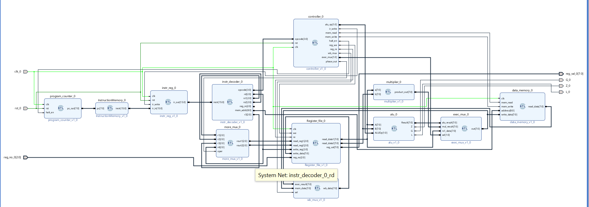

# 8-Bit Custom Processor with 16-Bit ISA & Multi-Cycle DSP

A fully custom, ground-up microprocessor designed in Verilog and synthesized for the Xilinx Spartan-7 FPGA. This architecture features an 8-bit datapath governed by a 16-bit Instruction Set Architecture (ISA), utilizing a hybrid Harvard memory structure. 

The crowning feature of this CPU is its **Multi-Cycle DSP capabilities**. It features a custom FSM controller and datapath bypass that enables 3-operand math (`rd = rs1 * rs2 + rs3`) using a standard 2-operand ALU by utilizing micro-operation phase tracking.

## 🛠 Hardware Target
* **Board:** Real Digital Boolean Board
* **FPGA:** Xilinx Spartan-7 (XC7S50)
* **Toolchain:** Xilinx Vivado 2025.2

## 🚀 Key Architectural Features
* **Variable-Cycle FSM:** The controller intelligently skips states to optimize execution (e.g., bypassing Write-Back for `CMP` and skipping Execute for `LOAD`).
* **Multi-Cycle MAC Unit:** Calculates Multiply-Accumulate operations `(A * B) + C` using a 1-bit phase counter to trap the FSM in the EXECUTE state, writing intermediate results securely to the destination register.
* **Smart Resource Utilization:** Synthesizes the 8x8 Register File into ultra-fast Distributed RAM (LUTRAM) and seamlessly maps the Instruction/Data memories into dedicated Block RAM (BRAM).
* **Hardware Flag Latching:** A dedicated Status Register safely latches Zero (Z), Greater (G), and Less (L) ALU flags to prevent combinational logic glitches during state transitions.

## 📜 Instruction Set Architecture (ISA)
The 16-bit instruction word is dynamically sliced by the decoder depending on the operation type.

### DSP-Type (3-Operand Math)
Used for Multi-Cycle execution.
* **Format:** `[15:12]` Opcode | `[11:9]` Dest (`rd`) | `[8:6]` Src1 (`rs1`) | `[5:3]` Src2 (`rs2`) | `[2:0]` Src3 (`rs3`)

| Opcode | Mnemonic | Operation | Execution Time |
| :---: | :--- | :--- | :---: |
| `A` | `MAC1` | `rd = (rs1 * rs2) + rs3` | 8 Clocks (2 Data Phases) |
| `B` | `MAC2` | `rd = (rs1 * rs2) + rs3` | 8 Clocks (2 Data Phases) |
| `C` | `ADD3` | `rd = (rs1 + rs2) + rs3` | 8 Clocks (2 Data Phases) |

### R-Type (Register Math/Logic)
Standard single-cycle ALU operations.
* **Format:** `[15:12]` Opcode | `[11:9]` Dest (`rd`) | `[8:6]` Src1 (`rs1`) | `[5:3]` Src2 (`rs2`) | `[2:0]` Unused

| Opcode | Mnemonic | Operation | Execution Time |
| :---: | :--- | :--- | :---: |
| `1` | `ADD` | `rd = rs1 + rs2` | 7 Clocks |
| `2` | `SUB` | `rd = rs1 - rs2` | 7 Clocks |
| `3` | `MUL` | `rd = rs1 * rs2` | 7 Clocks |
| `4` | `CMP` | Updates Z, G, L flags | 6 Clocks (Skips WB) |
| `5` | `MOV` | `rd = rs1` | 7 Clocks |

### M-Type (Memory)
* **Format:** `[15:12]` Opcode | `[11:9]` Dest/Src Reg | `[8:0]` Absolute Memory Address

| Opcode | Mnemonic | Operation | Execution Time |
| :---: | :--- | :--- | :---: |
| `6` | `LOAD` | `rd = Mem[addr]` | 6 Clocks (Skips EXEC) |
| `7` | `STORE` | `Mem[addr] = rs` | 7 Clocks |

## ⚙️ Synthesis & Implementation Results
* **LUTs:** 147 (Combinational Logic & Multiplier)
* **LUTRAM:** 18 (Distributed RAM for Register File)
* **Flip-Flops:** 30 (State tracking, PC, and IR)
* **BRAM:** 0.5 Tiles (Instruction ROM and Data RAM)

## 💻 How to Simulate & Run
1. Clone the repository.
2. Open Xilinx Vivado and create a new project targeting the `XC7S50` part.
3. Add all files in the `/src` folder as Design Sources.
4. Add all files in the `/sim` folder as Simulation Sources.
5. Add `/constraints/Boolean_Board.xdc` as your constraint file.
6. Make sure `inst.mem` is added to the project sources so the `Instruction.v` ROM can initialize the program.
7. Run the `cpu_sim.v` testbench to view the multi-cycle phase transitions, or generate the bitstream to program the physical board.

## 📜 Instruction Set Architecture (ISA) & Bit Fields
The processor utilizes a rigid 16-bit instruction word. The Instruction Decoder (`inst_deco.v`) routes these 16 bits into specific fields depending on the operation format. The upper 4 bits `[15:12]` always define the Opcode.

### 1. DSP-Type (3-Operand Math)
This custom format recycles the 16-bit word to fit a third source operand (`rs3`), enabling complex math in a single fetched instruction.
* **Format:** * `[15:12]` **Opcode** (4 bits)
  * `[11:9]` **Dest `rd`** (3 bits)
  * `[8:6]` **Src1 `rs1`** (3 bits)
  * `[5:3]` **Src2 `rs2`** (3 bits)
  * `[2:0]` **Src3 `rs3`** (3 bits)

| Opcode | Mnemonic | Name | Operation | Execution Time |
| :---: | :--- | :--- | :--- | :---: |
| `A` | `MAC1` | Multiply-Accumulate 1 | `rd = (rs1 * rs2) + rs3` | 8 Clocks |
| `B` | `MAC2` | Multiply-Accumulate 2 | `rd = (rs1 * rs2) + rs3` | 8 Clocks |
| `C` | `ADD3` | 3-Operand Addition | `rd = (rs1 + rs2) + rs3` | 8 Clocks |

### 2. R-Type (Register Math/Logic)
Standard single-cycle ALU operations. The final 3 bits are unused.
* **Format:** `[15:12]` Opcode | `[11:9]` Dest (`rd`) | `[8:6]` Src1 (`rs1`) | `[5:3]` Src2 (`rs2`) | `[2:0]` Unused

| Opcode | Mnemonic | Name | Operation | Execution Time |
| :---: | :--- | :--- | :--- | :---: |
| `1` | `ADD` | Addition | `rd = rs1 + rs2` | 7 Clocks |
| `2` | `SUB` | Subtraction | `rd = rs1 - rs2` | 7 Clocks |
| `3` | `MUL` | Multiplication | `rd = rs1 * rs2` | 7 Clocks |
| `4` | `CMP` | Compare | Updates Z, G, L flags | 6 Clocks (Skips WB) |
| `5` | `MOV` | Move | `rd = rs1` | 7 Clocks |

### 3. M-Type (Memory Operations)
* **Format:** `[15:12]` Opcode | `[11:9]` Dest/Src Reg | `[8:0]` Absolute Memory Address (512 locations)

| Opcode | Mnemonic | Name | Operation | Execution Time |
| :---: | :--- | :--- | :--- | :---: |
| `6` | `LOAD` | Load to Register | `rd = Mem[addr]` | 6 Clocks (Skips EXEC) |
| `7` | `STORE` | Store to Memory | `Mem[addr] = rs` | 7 Clocks |

---

## ⏱️ Performance Optimization: The MAC Advantage
A standard RISC processor requires multiple instructions to calculate a dot product or DSP filter equation like `(A * B) + C`. By designing a custom datapath bypass (`more_mux.v`) and a phase-driven FSM, this processor achieves massive performance gains over standard sequential execution.

**Without a dedicated MAC (Standard Execution):**
1. `MUL R4, R1, R2` *(Execution: 7 Clocks)*
2. `ADD R4, R4, R3` *(Execution: 7 Clocks)*
* **Total Time:** 14 Clocks
* **Memory Footprint:** 2 Instruction Words (32 bits)

**With Custom DSP Instructions (`MAC1 R4, R1, R2, R3`):**
1. The FSM traps the processor in the `EXEC` state for exactly 2 data phases, calculating the multiplication, routing the intermediate result, and performing the addition internally.
* **Total Time:** 8 Clocks
* **Memory Footprint:** 1 Instruction Word (16 bits)

**The Result:** A **~42% reduction** in execution time and a **50% reduction** in program memory footprint for DSP operations, all while reusing the existing 2-input ALU to save silicon.
